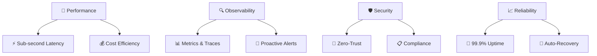

# 🌟 Hi, I'm Pannagendra! 

<div align="center">


</div>

<div align="center">
  
[](https://www.linkedin.com/in/pannagendra-kl-28113055/)
[](https://github.com/Pannagendra)
[](https://github.com/Pannagendra)
[](https://github.com/Pannagendra)

</div>

---

## 🎯 **What I Do**

I architect **production-grade MLOps platforms** and **blazing-fast GenAI/RAG systems** with laser focus on **observability**, **reliability**, and **cost efficiency**. My superpower? Transforming chaotic ML ideas into **battle-tested**, **measurable**, and **secure** production systems.

<div align="center">

```ascii
┌─────────────────────────────────────────────────┐
│  Messy ML Ideas  →  Production Systems  →  📈   │
│     🧪               ⚙️🔒📊              Impact  │
└─────────────────────────────────────────────────┘
```

</div>

---

## ⚡ **Core Expertise**

<table>
<tr>
<td width="50%">

### 🤖 **MLOps & LLMOps**
- 🔄 End-to-end ML lifecycle management
- 🧠 **RAG pipelines** with vector optimization
- 🛡️ Guardrails & evaluation frameworks
- 📊 Model drift monitoring & alerting
- 🎯 A/B testing for ML models

</td>
<td width="50%">

### ☁️ **Cloud & Platform Engineering**
- 🏗️ **AWS** native architectures (VPC → Production)
- ⚓ **Kubernetes** orchestration (EKS/GKE)
- 🏭 **Terraform** IaC for scalable infra
- 🔐 Security-first design patterns
- 💰 Cost optimization strategies

</td>
</tr>
<tr>
<td width="50%">

### 🚀 **DevOps & Automation**
- 🔁 GitOps workflows with ArgoCD
- 🛠️ CI/CD pipeline optimization
- 🐳 **Docker** containerization
- 📦 Supply chain security (SBOMs)
- 🔍 Observability (OpenTelemetry)

</td>
<td width="50%">

### 🐍 **Python Engineering**
- ⚡ **FastAPI** & **Flask** services
- 🧪 Test-driven development (pytest)
- 🏗️ Clean architecture patterns
- 🔧 CLI tooling & automation
- ⚙️ High-performance concurrency

</td>
</tr>
</table>

---

## 🏆 **Featured Projects**

### 🔥 **High-Performance RAG System**
[](https://github.com/Pannagendra/RAG)

> **Sub-second retrieval** • **Privacy-first** • **Production-ready**

- ⚡ **<500ms** query response time with optimized vector DB
- 🔒 **Local-first architecture** for sensitive data
- 🎛️ **Streamlit** demo with real-time performance metrics
- 🦙 **Ollama/Llama** integration with smart chunking
- 📊 Built-in evaluation hooks for quality assurance

**Tech Stack:** `Python` `Chroma/FAISS` `LangChain` `Streamlit` `Docker`

---

### 🌐 **Orchestrated RAG with Full Observability**
[](https://github.com/Pannagendra/Agentic_RAG)

> **Graph-based orchestration** • **Production monitoring** • **Interview-ready**

- 🕸️ **LangGraph** orchestration for complex workflows
- 👁️ **LangSmith** traces for debugging & optimization
- 📈 **Evidently** for model drift detection
- 🎯 End-to-end evaluation pipeline
- 🏭 Docker-ready for immediate deployment

**Tech Stack:** `LangGraph` `LangSmith` `Evidently` `Docker` `Python`

---

### 🏗️ **Production MLOps on AWS**
[](https://github.com/Pannagendra/MlopsSytemDesignAndHandsOnExp)

> **Enterprise-grade** • **Kubernetes-native** • **Cost-optimized**

- 🎯 Complete ML lifecycle: **Data → Train → Deploy → Monitor**
- 🔄 **GitOps** with ArgoCD for model deployments
- 🎚️ **Canary & Blue-Green** deployment strategies
- 💰 **Karpenter** autoscaling for cost efficiency
- 📊 **Prometheus/Grafana** monitoring stack

**Tech Stack:** `Terraform` `AWS EKS` `MLflow` `Airflow` `FastAPI` `Prometheus`

---

### 🧠 **GenAI Fundamentals**
[](https://github.com/Pannagendra/GenAIFundamentals)

> **Knowledge sharing** • **Best practices** • **Team enablement**

- 📚 Comprehensive guides: embeddings, vector DBs, RAG patterns
- ⚠️ Common pitfalls & how to avoid them
- 🎯 Evaluation strategies for GenAI systems
- 👥 Team onboarding materials

---

### 💻 **Daily Coding Practice**
[](https://github.com/Pannagendra/DailyCoding)

> **Algorithmic thinking** • **Problem solving** • **Continuous learning**

- 🧩 LeetCode & GeeksforGeeks daily challenges
- 🐍 Pythonic solutions with clean code principles
- 📈 Consistent practice for technical interviews

---

## 🛠️ **Technology Arsenal**

<div align="center">

### 🌩️ **Cloud & Infrastructure**


### 🤖 **ML & AI**


### 🔧 **DevOps & Tools**


</div>

---

## 📊 **GitHub Stats**

<div align="center">


</div>

---

## 🎯 **What I Optimize For**

<div align="center">



</div>

---

## 🚀 **Let's Build Something Amazing**

I'm passionate about collaborating on:

<table>
<tr>
<td>

### 🏗️ **Platform Engineering**
- ML/LLM platform architecture
- Kubernetes-native solutions
- Multi-cloud strategies
- Cost optimization

</td>
<td>

### 🤖 **GenAI & RAG**
- High-performance retrieval systems
- Evaluation frameworks
- Guardrails & safety
- Production monitoring

</td>
</tr>
</table>

---

## ⭐ **Quick Start Guide**

Want to see my work in action? Here's your **5-minute tour**:

<div align="center">

| 🎯 **Focus Area** | 📁 **Repository** | ⏱️ **Time** |
|---|---|---|
| **RAG Demo** | [`RAG`](https://github.com/Pannagendra/RAG) | 2 min |
| **Agentic Workflows** | [`Agentic_RAG`](https://github.com/Pannagendra/Agentic_RAG) | 3 min |
| **MLOps Architecture** | [`MLOps System Design`](https://github.com/Pannagendra/MlopsSytemDesignAndHandsOnExp) | 5 min |

</div>

---

<div align="center">

### 💡 **"Turning complexity into clarity, one system at a time."**


</div>

---

<div align="center">
<sub>⚡ This README is optimized for impact - just like my code! ⚡</sub>
</div>
